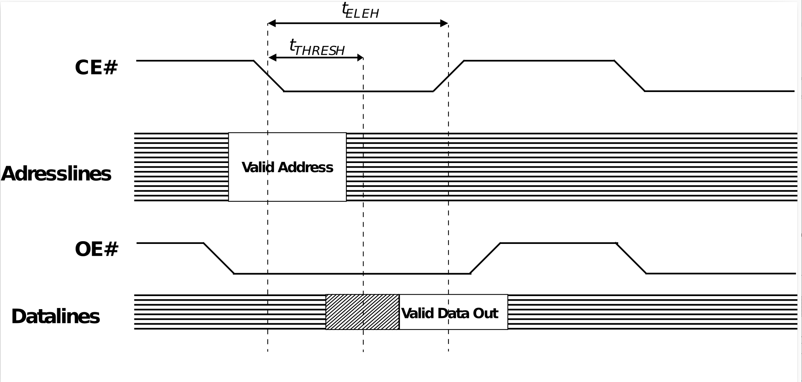
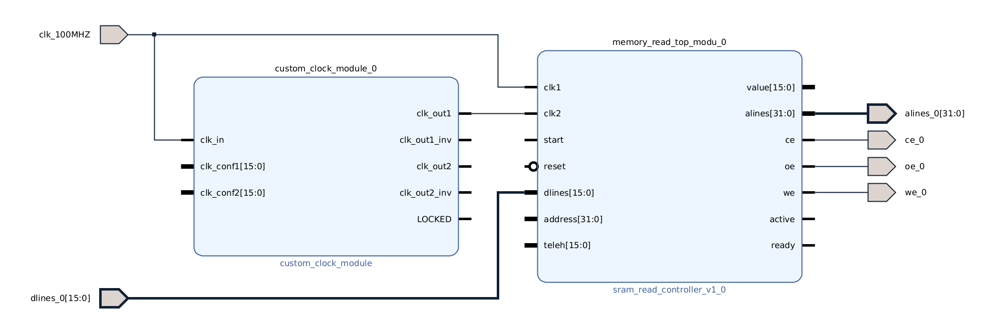
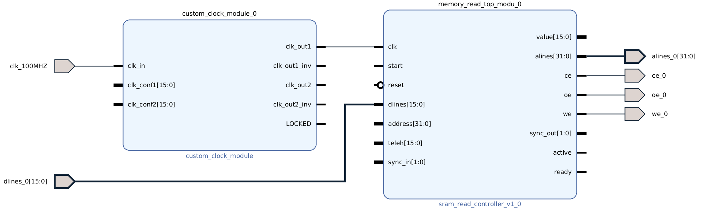

# SRAM Memory controller

This repository comprises the implementation of an SRAM controller consisting of two distinct IP cores. One core handles memory read operations, while the other core handles memory write operations. These IP cores are compatible with nearly every Xilinx FPGAs. Communication with the memory module is established through direct manipulation of GPIO wires. The timing requirements, as well as the data and address bus widths, can be adjusted using external parameters or data sent to the module via wires. To achieve more accurate timing it is recommented to use higher clock frequencies, e.g. 500 Mhz. To generate these clock frequencies a specific clocking module ([Clocking Module](https://github.com/FlorianFrank/Verilog_Snippets/tree/main/Custom_Clock)) can be used.
The implemented SRAM protocol is depicted in the subsequent figure:

## Reading IP core

The reading IP core can be added to your block design by adding **sram_controller_read** to your IP-cores repository. 

### The IP-core has following parameters:

|Parameter|Description|
|----|-----|
|Freq Clk1|Frequency of the clock on which the block diagram is running in which this IP-core is embedded. This parameter is required to synchronize the response between the components running on Clk1 and the higher clock frequency provided to this IP-core by Clk2|
|Freq Clk2|Dedicated clock, e.g. provided by the clocking module, to achieve higher clock frequencies and more precise timing when accessing the memory.|
|Idle Delay| Delay after reading from the memory. |
|Idle Delay| Delay before starting the read operation. |

### The IP-core has following input wires:

|Signal|Description|
|----|-----|
|clk| Input clock with clock frequency specified by Freq Clk2. (Must be alligned with the rising flanks of Clk1)|
|start| When set to high for at least one clock cycle of Clk2. The module starts reading |
|reset| Resets all wires. The state-machine changes back to the INIT state.|
|dlines[DATA_WIDTH-1: 0]| Must be connected to the physical data lines of the FPGA. Adjustable by the parameter **Data Width.** |
|address[ADDRESS_WIDTH-1:0]| Selected address to read from. Adjustable by the parameter **Address Bus Size.** |
|teleh[CLOCK_CONFIG_SIZE-1:0]| Adjustment of the timing data setup time, like shown in Figure 1. Adjustable by the parameter **Clock Config Width.** |
|sync_in| Should later be removed. Used for synchronization purposes. |

### The IP-core has following output wires:

|Signal|Description|
|----|-----|
|value[DATA_WIDTH-1: 0]| Output value provided to a connected module read from dlines. Can also be ajusted by the **Data Width** parameter. |
|alines[ADDRESS_WIDTH-1: 0]| Address provided to the GPIO pins of the FPGA. Can be adjusted by the **Address Bus Size** parameter.  |
|ce| Chip Enable signal forwarded to the GPIO pins.|
|we| Write Enable signal forwarded to the GPIO pins.|
|we| Write Enable signal forwarded to the GPIO pins.|
|sync_out| Should later be removed. Used for synchronization purposes.|
|active| Indicates if the internal state machine of the module is in IDLE mode or running. |
|ready| Indicates when a value from the value output wire can be read reliable.|

### Sample block diagram:

This figure shows a sample block diagram how the custom clock module is connected to the IP-core. The signals alines, dlines, ce, oe and we must be connected to the GPIO pins of the board. 
start, reset, active, ready and value must be connected to a custom module.s

